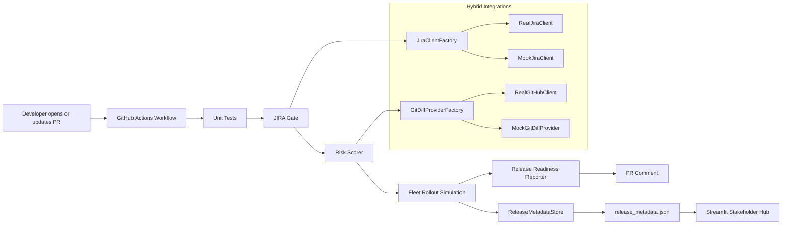

# Automated Release Governance Engine (ARGE) — V3

ARGE is a hybrid CI/CD governance system that behaves like a lightweight **Technical Program Manager in software**. It inserts release-readiness gates into the pull request path, scores deployment risk, simulates staged rollout timing, and publishes a stakeholder-friendly status view.

V3 adds a **Hybrid Integration Phase**: the app automatically uses live JIRA and GitHub APIs when credentials are available, and silently falls back to mock mode when they are not. That makes the project both **portfolio-ready** and **recruiter-friendly on first run**.

## Why this matters for TPM

Technical Program Managers operate at the boundary between engineering execution, risk visibility, and release accountability. ARGE demonstrates that mindset in code:

- It enforces **release discipline in CI** instead of relying on manual follow-up.
- It translates engineering activity into **stakeholder-readable release risk**.
- It creates a visible record of **cross-functional sign-off health**.
- It models deployment sequencing through a **canary rollout simulation**.
- It shows how a TPM-style system can be designed to be both **operationally real** and **demo-safe**.

## Core capabilities

- **JIRA Gate**: Extracts a linked ticket from PR metadata and verifies it is in `Approved` status.
- **Risk Scorer**: Flags risky changes when PR diffs are large or sensitive files are touched.
- **Hybrid Client Factory**: Chooses between live API clients and mock clients based on environment variables.
- **Fleet Rollout Simulation**: Estimates deployment timing across **1% → 10% → 100%** canary waves.
- **Release Readiness Report**: Produces markdown ready to post back to a PR.
- **Stakeholder Hub**: Streamlit dashboard with release version, sign-offs, rollout timing, and current data source.
- **Release Metadata Store**: JSON-backed demo persistence for local runs and portfolio screenshots.

## System architecture



## Repository structure

```text
arge/
├── .env.example
├── .github/workflows/release_governance.yml
├── app.py
├── release_metadata.json
├── requirements.txt
├── src/
│   └── arge/
│       ├── cli/
│       ├── data/
│       ├── gates/
│       ├── integrations/
│       ├── release/
│       ├── reporting/
│       ├── utils/
│       ├── logging_config.py
│       └── models.py
└── tests/
```

## Integration behavior

ARGE uses a zero-key default experience:

- When `JIRA_DOMAIN`, `JIRA_USER_EMAIL`, and `JIRA_API_TOKEN` are present, the JIRA gate uses the **live Atlassian REST API**.
- When `GH_TOKEN`, `GITHUB_REPOSITORY`, and `PR_NUMBER` are present, the risk pipeline uses the **live GitHub REST API** for PR file changes.
- When any required variables are missing, ARGE logs:

```text
Environment variables missing: Running in Mock Mode for demonstration.
```

That means recruiters, hiring managers, and forked-repo visitors can run the project without setup friction.

## Getting started

### 1) Clone and create a virtual environment

```bash
git clone <your-repo-url>
cd arge
python -m venv .venv
source .venv/bin/activate
pip install --upgrade pip
pip install -r requirements.txt
export PYTHONPATH=src
```

### 2) Optional: enable live integrations

```bash
cp .env.example .env
# then fill in the values you actually have
```

ARGE will still run without these values.

### 3) Run the unit tests

```bash
pytest -q
```

### 4) Start the dashboard

```bash
streamlit run app.py
```

### 5) Run the gates locally

#### JIRA Gate

```bash
export GITHUB_EVENT_PATH=.github/mock_event.json
python -m arge.cli.jira_gate
```

#### Risk Scorer

```bash
export BASE_SHA=<base_sha>
export HEAD_SHA=<head_sha>
export PR_NUMBER=42
python -m arge.cli.risk_scorer
```

#### Generate readiness report

```bash
export JIRA_TICKET=ARGE-123
export JIRA_STATUS=Approved
export PR_NUMBER=42
export RISK_INPUT=risk_report.json
python -m arge.cli.readiness_report
```

#### Update metadata store

```bash
export RELEASE_METADATA_FILE=release_metadata.json
export ARGE_DATA_SOURCE="Mock Simulation"
python -m arge.cli.update_release_metadata
```

## Secrets and configuration

See `.env.example` for the expected values:

- `JIRA_DOMAIN`
- `JIRA_USER_EMAIL`
- `JIRA_API_TOKEN`
- `GH_TOKEN`
- `GITHUB_REPOSITORY`
- `PR_NUMBER`
- `ARGE_LOG_LEVEL`

In GitHub Actions, the workflow checks for secrets first. If they are missing, such as in forks, the pipeline continues in mock mode so the visitor experience stays smooth.

## Logging

ARGE uses centralized logging so local runs and GitHub Actions output read like production software.

Example:

```text
2026-04-08 09:15:32 | INFO     | arge.github.diff.factory | GitHub credentials detected: using live GitHub REST API client.
```

## Next production-hardening ideas

- Replace JSON metadata persistence with PostgreSQL or S3.
- Add retry/backoff wrappers around external API calls.
- Capture real sign-offs from QA, Product, and Engineering systems.
- Add CODEOWNERS and test coverage signals into the risk model.
- Persist PR comments idempotently instead of posting a fresh one each run.
