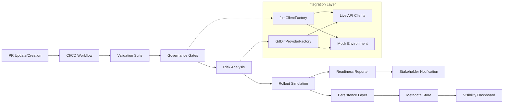

# Automated Release Governance Engine (ARGE)

ARGE is a modular, CI/CD-integrated framework designed to orchestrate high-stakes software deployments. It automates **technical and operational compliance guardrails** by enforcing release-readiness gates, calculating deployment risk through algorithmic scoring, and simulating staged rollout strategies for complex fleet environments.

Built with a **Hybrid Integration Architecture**, ARGE dynamically pivots between live REST APIs (JIRA/GitHub) and isolated mock environments, ensuring a seamless "zero-configuration" experience for stakeholders and reviewers.

## Strategic Value

This engine demonstrates a production-first approach to the Software Development Life Cycle (SDLC), applicable to Engineering, Product, and Operational leadership:

* **Automated Governance:** Replaces manual checklists with code-enforced gates in the CI pipeline to ensure **strict adherence to release criteria**.
* **Data-Driven Risk Assessment:** Translates technical diffs into objective, actionable risk metrics for non-technical stakeholders.
* **Cross-Functional Alignment:** Synchronizes project management states (JIRA) with version control reality (GitHub) to eliminate manual status tracking.
* **Staged Reliability:** Models risk-mitigation through **1% → 10% → 100%** canary rollout simulations to protect fleet stability.
* **Architectural Flexibility:** Implements Factory and Strategy design patterns to handle diverse integration environments and enterprise scale.


## Core Capabilities

* **JIRA Integration Gate:** Validates cross-functional approval states via Atlassian REST APIs, ensuring code only moves forward when officially sanctioned by stakeholders.
* **Heuristic Risk Scorer:** Analyzes PR metadata and diffs to flag high-impact changes based on change volume (e.g., >50 lines) and file sensitivity (e.g., core infrastructure logic vs. documentation).
* **Hybrid Client Factory:** Intelligently toggles between live REST API clients and isolated mock environments based on the environmental context to ensure a seamless, zero-setup demo experience.
* **Fleet Rollout Simulator:** Generates deterministic deployment timelines for staged releases, modeling risk mitigation through **1% → 10% → 100%** canary waves.
* **Automated Reporting:** Synthesizes complex pipeline results into professional Markdown summaries designed for automated injection into Pull Request discussions.
* **Stakeholder Dashboard:** A Streamlit-based UI providing real-time visibility into release health, sign-off status, and data provenance via a JSON-backed metadata store.

## System architecture



## Repository structure

```text
arge/
├── .env.example
├── .github/workflows/release_governance.yml
├── app.py
├── release_metadata.json
├── requirements.txt
├── src/
│   └── arge/
│       ├── cli/
│       ├── data/
│       ├── gates/
│       ├── integrations/
│       ├── release/
│       ├── reporting/
│       ├── utils/
│       ├── logging_config.py
│       └── models.py
└── tests/
```

## Credential Security & Environment Configuration

System integrity is maintained by strict adherence to environment-based configuration. Sensitive credentials (API Tokens, Domain Endpoints) are never persisted in source control. ARGE utilizes a `python-dotenv` implementation for local development and leverages encrypted environment variables for secure CI/CD execution. In public-facing environments, the system defaults to **"Simulation Mode"** to prevent unauthorized data exposure while maintaining full functional visibility for reviewers.


## Getting started

### 1) Clone and create a virtual environment

```bash
git clone <your-repo-url>
cd arge
python -m venv .venv
source .venv/bin/activate
pip install --upgrade pip
pip install -r requirements.txt
export PYTHONPATH=src
```

### 2) Optional: enable live integrations

```bash
cp .env.example .env
# then fill in the values you actually have
```

ARGE will still run without these values.

### 3) Run the unit tests

```bash
pytest -q
```

### 4) Start the dashboard

```bash
streamlit run app.py
```

### 5) Run the gates locally

#### JIRA Gate

```bash
export GITHUB_EVENT_PATH=.github/mock_event.json
python -m arge.cli.jira_gate
```

#### Risk Scorer

```bash
export BASE_SHA=<base_sha>
export HEAD_SHA=<head_sha>
export PR_NUMBER=42
python -m arge.cli.risk_scorer
```

#### Generate readiness report

```bash
export JIRA_TICKET=ARGE-123
export JIRA_STATUS=Approved
export PR_NUMBER=42
export RISK_INPUT=risk_report.json
python -m arge.cli.readiness_report
```

#### Update metadata store

```bash
export RELEASE_METADATA_FILE=release_metadata.json
export ARGE_DATA_SOURCE="Mock Simulation"
python -m arge.cli.update_release_metadata
```

## Credential Security & Environment Configuration

See `.env.example` for the expected values:

- `JIRA_DOMAIN`
- `JIRA_USER_EMAIL`
- `JIRA_API_TOKEN`
- `GH_TOKEN`
- `GITHUB_REPOSITORY`
- `PR_NUMBER`
- `ARGE_LOG_LEVEL`

In GitHub Actions, the workflow checks for secrets first. If they are missing, such as in forks, the pipeline continues in mock mode so the visitor experience stays smooth.

## Logging

ARGE uses centralized logging so local runs and GitHub Actions output read like production software.

Example:

```text
2026-04-08 09:15:32 | INFO     | arge.github.diff.factory | GitHub credentials detected: using live GitHub REST API client.
```

## Future Roadmap

* **Data Persistence:** Transition from local JSON stores to a managed relational database (PostgreSQL) for fleet-scale tracking.
* **Performance Optimization:** Implement asynchronous request handling to minimize latency in multi-gate governance pipelines.
* **Enhanced Risk Modeling:** Incorporate automated code-coverage metrics and static analysis (SAST) signals into the risk scoring algorithm.
* **Enterprise Scalability:** Develop multi-tenant support for managing concurrent, global release cycles across distinct product lines.
